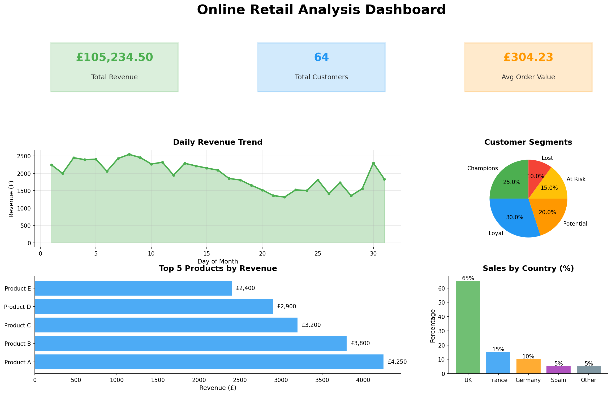

# Online Retail Analysis

This project presents a comprehensive data-driven analysis of an e-commerce transactional dataset, focusing on two key objectives: **customer segmentation** and **product recommendation**. The data processing and machine learning components were implemented using Python, while data visualization was accomplished using Power BI.

## 📋 Project Structure

```
Online-Retail-Analysis/
│
├── README.md                                              # Project documentation
├── requirements.txt                                       # Python dependencies
│
├── data/                                                  # Data directory
│   ├── raw_data.csv                                      # Original e-commerce transaction data
│   ├── processed_data.csv                                # Cleaned and feature-engineered data
│   ├── customer_segments.csv                             # Customer segmentation results
│   └── segment_analysis.csv                              # Segment characteristics
│
├── notebooks/                                             # Jupyter notebooks
│   ├── 01_Data_Cleaning_Feature_Engineering.ipynb       # Data cleaning and feature engineering
│   └── 02_Modeling_Analysis.ipynb                        # Customer segmentation and product recommendations
│
└── dashboard/                                             # Visualization
    ├── Online_Retail_Dashboard.pbix.txt                  # Power BI dashboard instructions
    └── dashboard_screenshot.png                           # Dashboard preview
```

## 🎯 Project Objectives

1. **Customer Segmentation**: Identify distinct customer groups based on purchasing behavior using RFM (Recency, Frequency, Monetary) analysis and K-Means clustering
2. **Product Recommendation**: Build a recommendation system to suggest products based on customer purchase patterns
3. **Business Insights**: Extract actionable insights to drive marketing and sales strategies

## 📊 Dataset

The dataset contains online retail transactions with the following features:
- **InvoiceNo**: Unique invoice number for each transaction
- **StockCode**: Unique product code
- **Description**: Product description
- **Quantity**: Number of items purchased
- **InvoiceDate**: Date and time of transaction
- **UnitPrice**: Price per unit
- **CustomerID**: Unique customer identifier
- **Country**: Customer's country

## 🔧 Installation

### Prerequisites
- Python 3.8 or higher
- Jupyter Notebook
- Power BI Desktop (for dashboard visualization)

### Setup

1. Clone the repository:
```bash
git clone https://github.com/user-w-ui/Online-Retail-Analysis.git
cd Online-Retail-Analysis
```

2. Install required packages:
```bash
pip install -r requirements.txt
```

3. Launch Jupyter Notebook:
```bash
jupyter notebook
```

## 🚀 Usage

### Step 1: Data Cleaning and Feature Engineering
Open and run `notebooks/01_Data_Cleaning_Feature_Engineering.ipynb`:
- Loads raw transaction data
- Performs exploratory data analysis (EDA)
- Cleans data (removes duplicates, handles missing values, filters invalid transactions)
- Engineers features (TotalPrice, date components, RFM metrics)
- Generates processed datasets

### Step 2: Modeling and Analysis
Open and run `notebooks/02_Modeling_Analysis.ipynb`:
- Performs RFM analysis for customer segmentation
- Applies K-Means clustering to identify customer groups
- Builds product recommendation system using collaborative filtering
- Generates business insights and recommendations
- Saves segmentation results

### Step 3: Dashboard Visualization
- Import processed CSV files into Power BI Desktop
- Follow instructions in `dashboard/Online_Retail_Dashboard.pbix.txt`
- Create interactive visualizations for business stakeholders

## 📈 Key Findings

### Customer Segmentation
The analysis identified 5 distinct customer segments:
- **Champions**: High-value customers with recent purchases
- **Loyal Customers**: Regular purchasers with good engagement
- **Potential Loyalists**: Recent customers with growth potential
- **At Risk**: Previously active customers showing declining engagement
- **Lost**: Inactive customers requiring win-back campaigns

### Product Recommendations
- Collaborative filtering system for personalized product suggestions
- Identifies products frequently purchased together
- Enables cross-selling and upselling opportunities

### Business Metrics
- Total revenue, transaction count, and customer count
- Average order value and customer lifetime value
- Top-performing products and customers
- Geographic sales distribution
- Temporal patterns (hourly, daily, monthly trends)

## 🎨 Visualizations

The Power BI dashboard includes:
- **KPI Cards**: Revenue, customers, average order value
- **Trend Analysis**: Daily/monthly revenue patterns
- **Segmentation Charts**: Customer segment distribution
- **Geographic Maps**: Sales by country
- **Product Performance**: Top products and categories
- **Time-based Analysis**: Sales by hour and day of week



## 💡 Business Recommendations

1. **For Champions & Loyal Customers**:
   - Implement VIP programs and exclusive offers
   - Request product reviews and referrals

2. **For Potential Loyalists**:
   - Send targeted promotions to increase purchase frequency
   - Offer loyalty rewards

3. **For At Risk Customers**:
   - Launch win-back campaigns
   - Send personalized offers based on previous purchases

4. **For Lost Customers**:
   - Survey to understand churn reasons
   - Offer significant incentives to re-engage

5. **Product Strategy**:
   - Focus inventory on top-performing products
   - Use recommendation system for cross-selling
   - Bundle frequently co-purchased items

## 📦 Dependencies

All required Python packages are listed in `requirements.txt`:
- pandas
- numpy
- matplotlib
- seaborn
- scikit-learn
- jupyter
- notebook
- ipykernel
- plotly

## 🤝 Contributing

Contributions are welcome! Please feel free to submit a Pull Request.

## 📄 License

This project is open source and available under the MIT License.

## 📧 Contact

For questions or feedback, please open an issue in the GitHub repository.
